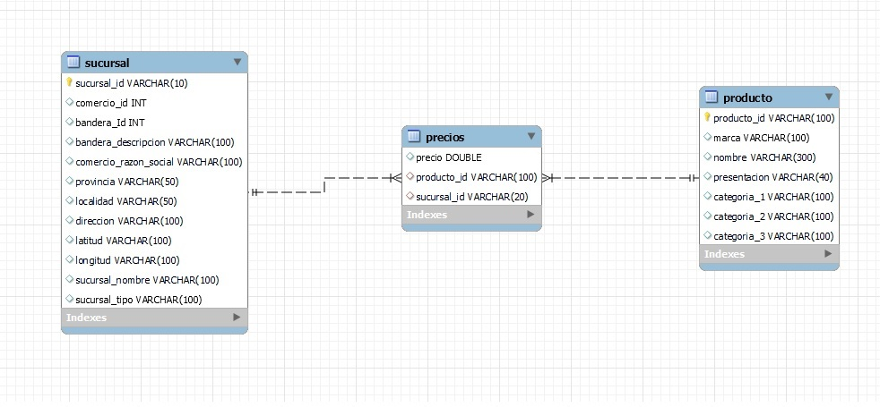
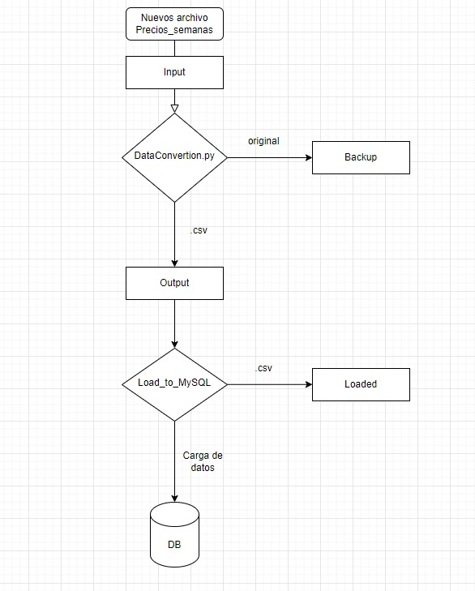

# Proyecto Individual N° 01 ##

Objetivo: 
Realizar un proceso de ETL a partir de un conjunto de datos provenientes de un negocio mayorista. El proceso debe estar automatizado para ingestas semanales de precios, debiendo hacerse de forma automática el normalizado, procesamiento y carga de datos a la base de datos.

## Creación de la base de datos: ##

Se utilizó MySQL para crear una base de datos con 3 tablas: Precios, Producto y Sucursal.
Para eso se crearon las siguientes tablas y se relacionaron de la siguiente forma:

En ellas se cargaron los datos provenientes de los archivos sucursal.csv (archivo que no necesitó ninguna modificación), producto.parquet (fue convertido a .csv).

Para cargar los archivos de precios, se procedió de manera distinta ya que se presentaron varios archivos con distinta extensión y con varias fallas que impedían la correcta carga a la base de datos. 

Se estableció un procedimiento con el siguiente orden para abarcar futuros errores de carga de datos para nuevos archivos:

- Importación del archivo a Python
- Ordenamiento de las columnas
- Remplazo de valores vacíos por NaN
- Eliminación de las filas con valores NaN (*)
- Eliminación de filas duplicadas
- Exportación del archivo en formato .csv

(*) Se consideró como correcta la eliminación de los valores faltantes ya que no tener un valor de cualquiera de las columnas de la tabla precios impedían realizar cualquier tipo de análisis con el resto de los valores de la fila. 

## Explicación del flujo de ETL: ##

Con el fin de realizar la carga del archivo 'precios_semana_20200518.txt' de manera automática, se diseñó un flujo de ETL que sea intuitivo y evite la pérdida de información original. 

El archivo de precios semanal a cargar debe situarse en la carpeta Input. 
Al ejecutar el script 'DataConversion.py', se realiza el proceso antes detallado y automáticamente se crea una copia del archivo original que será guardado en la carpeta Backup y se elimina el archivo de la carpeta Input. El objetivo de esta proceso es mantener la carpeta Input sólo para datasets no procesados. El archivo .csv resultante queda almacenado en la carpeta Output paa luego ser cargado a la base de datos.

Ésto último se realiza con el script 'Load_to_MySQL.py'. En él se realiza la conexión con la base de datos en MySQL y se ingestan los nuevos datos en la tabla Precios. 

Por último, éste script mueve el archivo proventiente de Output a una última carpeta llamada Loaded, que indica que el flujo de ese archivo finalizó y ya fue subido a la base de datos.

Link video explicativo: https://www.youtube.com/watch?v=z8BZMYI3rtU&ab_channel=ArielSerafini

